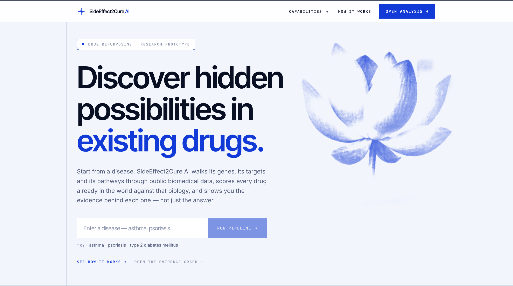
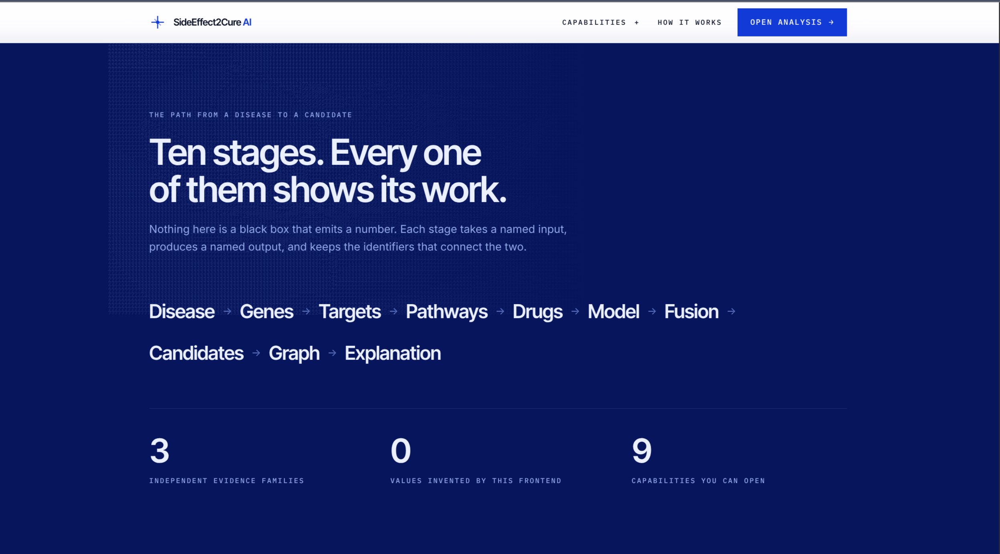
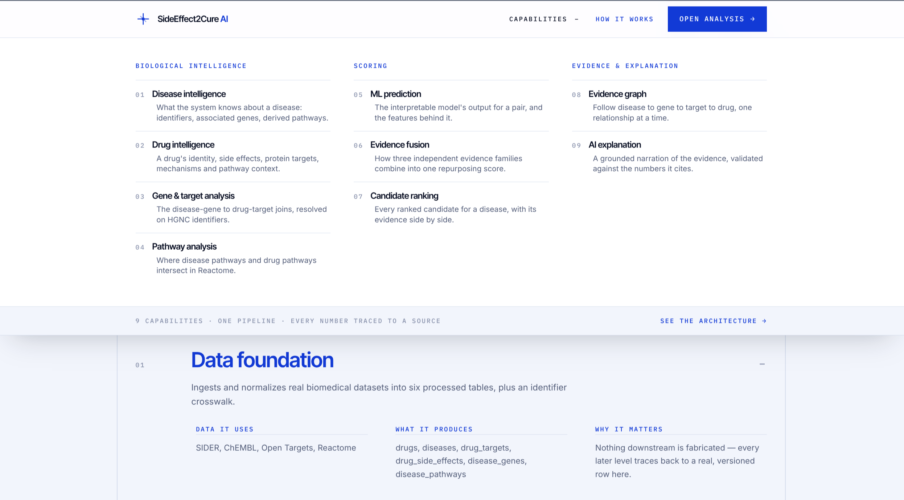
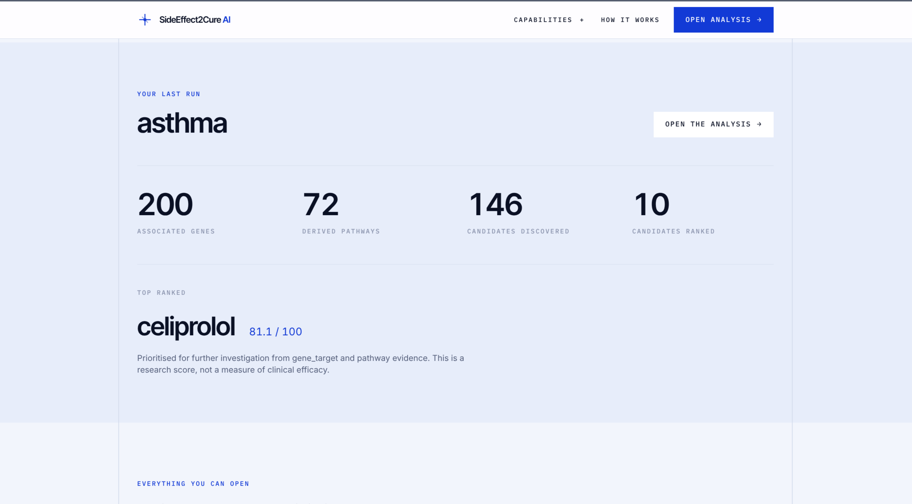
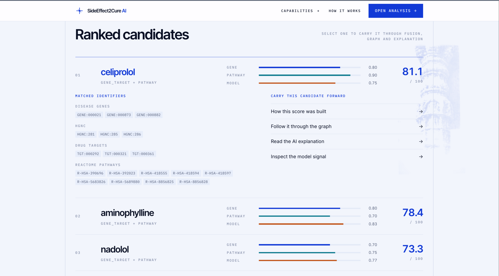
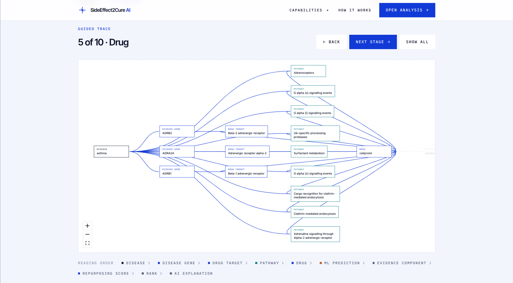
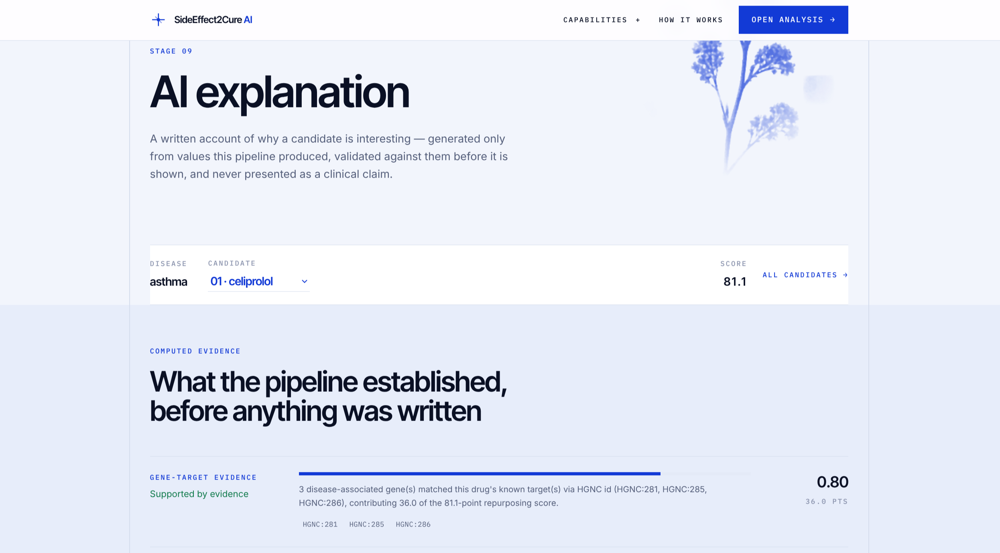

# 🔬 SideEffect2Cure AI

**AI-driven drug repurposing discovery platform.**

For a given disease, which existing, already-approved drugs are potentially
promising candidates for repurposing — and *why*? SideEffect2Cure AI answers
that question by walking real public biomedical data through a fully
transparent, ten-stage pipeline: every score, rank, and AI-written sentence
traces back to a value the pipeline itself produced.

> ⚠️ **Research prototype.** This project does **not** diagnose, treat, or cure
> any disease, makes no claim that any drug cures any disease, and is **not**
> a clinical decision-support system. All output is hypothesis-generating
> only, meant to point researchers toward candidates worth investigating
> further.

<p align="center">
  
</p>

---

## Table of contents

- [What it does](#what-it-does)
- [Why it's different](#why-its-different)
- [Screenshots](#screenshots)
- [The pipeline, stage by stage](#the-pipeline-stage-by-stage)
- [Tech stack](#tech-stack)
- [Repository layout](#repository-layout)
- [Getting started](#getting-started)
  - [Backend](#backend)
  - [Frontend](#frontend)
  - [Data foundation](#data-foundation)
- [Project status](#project-status)

---

## What it does

Type in a disease name — `asthma`, `psoriasis`, `type 2 diabetes mellitus` —
and SideEffect2Cure AI:

1. Resolves the disease to its associated genes and derived biological pathways.
2. Reduces the full ~1,430-drug universe down to the drugs biologically connected to that disease.
3. Builds a deterministic feature vector for every disease–drug pair.
4. Runs an interpretable ML model to estimate clinical-indication likelihood.
5. Fuses gene-target evidence, pathway evidence, and the ML signal into one transparent **0–100 repurposing score**.
6. Ranks every candidate by that score.
7. Renders an interactive **evidence graph** tracing disease → genes → targets/pathways → drug → score → rank.
8. Asks an LLM (with strict grounding checks) to narrate *why* the top candidate scored the way it did — falling back to a deterministic explanation if the model is unavailable or its answer doesn't check out.

## Why it's different

- **Nothing is a black box.** Every stage takes a named input, produces a
  named output, and keeps the identifiers that connect the two — you can
  click through from a final score all the way back to the gene and pathway
  rows that produced it.
- **Nothing is fabricated.** All biology comes from real public sources
  (SIDER, ChEMBL, Open Targets, Reactome). Unreachable sources are reported,
  never faked.
- **The AI never freelances.** The Phase 9 explanation model is handed only
  the structured evidence the deterministic pipeline already computed. Its
  prose is validated against that evidence (identity/score match, no
  fabricated identifiers, no clinical-claim language) before it's shown; any
  failure falls back automatically to a template-based explanation, and the
  frontend always labels which one you're looking at.
- **Scores are honest about what they are.** The `repurposing_score` is
  explicitly an *internal research prioritization score* — not a measure of
  clinical efficacy, safety, or treatment probability — and every page that
  shows it says so.

## Screenshots

| | |
|---|---|
| **Landing page** — start from a disease name | **How it works** — the ten stages, end to end |
|  |  |
| **Capabilities** — all 9 pipeline stages, browsable | **Dashboard** — your last run, at a glance |
|  |  |
| **Ranked candidates** — every candidate, evidence side by side | **Evidence graph** — a guided, node-by-node trace |
|  |  |
| **AI explanation** — grounded prose over computed evidence | |
|  | |

## The pipeline, stage by stage

```
Disease → Genes → Targets → Pathways → Drugs → Model → Fusion → Candidates → Graph → Explanation
```

| Level / Phase | Name | What it produces |
|---|---|---|
| **Level 1** | Data foundation | 6 normalized tables from SIDER, ChEMBL, Open Targets, Reactome + an identifier crosswalk |
| **Level 2** | Disease intelligence | Canonical `DiseaseProfile` — associated genes, derived pathways, provenance |
| **Level 3** | Drug intelligence | Canonical `DrugProfile` — side effects, targets, mechanisms, pathway context |
| **Level 4** | Candidate generation | The ~1,430-drug universe reduced to biologically-connected candidates (gene-target ∪ pathway) |
| **Level 5** | Feature engineering | A deterministic `FeatureVector` per candidate — counts, ratios, availability flags |
| **Phase 6** | ML prediction | An interpretable model's output + its top contributing features, per candidate |
| **Phase 7** | Evidence fusion | The 3 evidence families fused into one transparent 0–100 `repurposing_score` |
| **Phase 8** | Candidate ranking | Deterministic ordering by score, ties broken by `drug_id` |
| **Phase 9** | AI explanation | Grounded, validated prose narrating *why* — DeepSeek V4 Flash, with deterministic fallback |
| **Phase 10** | Evidence graph | A frontend-ready `nodes[]` / `edges[]` graph answering "why was this drug prioritized?" |

See [`docs/architecture.md`](docs/architecture.md) for the full pipeline design and per-level status, and the per-level docs linked in [Repository layout](#repository-layout) for the details of each stage.

## Tech stack

**Backend** — Python · FastAPI · pandas / numpy / scikit-learn · NetworkX
**Frontend** — React + TypeScript, one route per pipeline stage
**AI explanation** — DeepSeek V4 Flash via Featherless's OpenAI-compatible API (Phase 9 only, with an always-available deterministic fallback)
**Data sources** — SIDER · ChEMBL · Open Targets · Reactome

## Repository layout

```
sideeffect2cure/
├── backend/
│   ├── app/
│   │   ├── api/             FastAPI routers
│   │   ├── core/            config, disclaimers
│   │   ├── models/          schemas (disease L2, drug L3, candidate L4,
│   │   │                    feature L5, prediction P6, fusion P7, ranking P8,
│   │   │                    explanation P9, graph P10)
│   │   ├── services/        business logic; disease/ (L2) drug/ (L3)
│   │   │                    candidates/ (L4) features/ (L5) ml/ (P6) fusion/ (P7)
│   │   │                    ranking/ (P8) explanation/ (P9) graph/ (P10)
│   │   ├── data/            biomedical data foundation (Level 1): sources,
│   │   │                    schemas, identifier normalization, ingestion
│   │   ├── features/        feature engineering
│   │   ├── ml/               interpretable models
│   │   └── explainability/  rationale generation
│   ├── tests/
│   ├── requirements.txt
│   └── pyproject.toml
├── frontend/                React + TypeScript site — one page per pipeline stage
│   ├── src/api/             typed mirror of the backend schemas + fetch client
│   ├── src/pages/           the 11 routes (home, how-it-works, 9 capabilities)
│   ├── src/components/ui/   the design primitives the pages compose
│   ├── scripts/build-art.py derives the cyanotype artwork + digit textures
│   └── public/art/          generated artwork (committed)
├── data/                    raw / processed / features (git-ignored contents)
├── notebooks/
├── scripts/                 ingest_data.py, validate_data.py (L1), train_model.py (P6),
│                            explain_candidates.py (P9), build_evidence_graph.py (P10)
├── docs/
│   ├── screenshots/                 README screenshots
│   ├── architecture.md              canonical pipeline + level status
│   ├── data.md                      Level 1 data foundation (sources, schemas, licensing)
│   ├── disease-intelligence.md      Level 2 resolver + disease profile
│   ├── drug-intelligence.md         Level 3 resolver + drug profile
│   ├── candidate-generation.md      Level 4 candidate drug generation
│   ├── feature-engineering.md       Level 5 disease-drug feature vectors
│   ├── ml-prediction.md             Phase 6 ML prediction + interpretability
│   ├── evidence-fusion.md           Phase 7 evidence fusion + repurposing score
│   ├── candidate-ranking.md         Phase 8 candidate ranking
│   ├── ai-explanation.md            Phase 9 grounded AI-powered candidate explanation
│   └── evidence-graph.md            Phase 10 evidence graph
└── README.md
```

## Getting started

### Backend

```bash
cd backend
python -m venv .venv && source .venv/bin/activate
pip install -r requirements.txt

uvicorn app.main:app --reload      # http://127.0.0.1:8000/docs
pytest                             # run tests
```

Set `FEATHERLESS_API_KEY` to enable the Phase 9 DeepSeek explanation
provider. Without it, the backend returns its deterministic summary instead
— and the frontend always labels the difference, never presenting one as the
other.

### Frontend

```bash
cd frontend
npm install
npm run dev        # http://localhost:5173 — expects the backend on :8000
npm test           # vitest
npm run build      # typecheck + production build
```

Every number the site shows comes from a backend response; the frontend
holds no scientific logic of its own. The artwork is derived from a single
reference sheet by `scripts/build-art.py` — re-run it only if that sheet
changes.

### Data foundation

Builds six normalized tables (`drugs`, `diseases`, `drug_targets`,
`drug_side_effects`, `disease_genes`, `disease_pathways`) from real public
sources — SIDER, ChEMBL, Open Targets, Reactome — plus an internal↔external
identifier crosswalk. Nothing is fabricated; unreachable sources are
reported, not faked.

```bash
python scripts/ingest_data.py       # download + normalize -> data/processed/
python scripts/validate_data.py     # cross-table data-quality checks
```

Downloaded and generated data under `data/**` is git-ignored — regenerate it
with the script. Full details, schemas and licensing:
[`docs/data.md`](docs/data.md).

---

## Feature reference

<details>
<summary><strong>Disease intelligence (Level 2)</strong></summary>

Resolves a disease name / id / ontology id / alias to a canonical
`DiseaseProfile` (associated genes + derived pathways + provenance + a
deterministic summary). No fuzzy matching — unknown queries return an
explicit "not supported" result.

```python
from app.services.disease import build_disease_profile
p = build_disease_profile("Glioblastoma")   # or "GBM", "MONDO_0018177"
[g.gene_name for g in p.genes[:5]]           # ['TP53', 'IDH1', 'EGFR', 'PTEN', 'BRAF']
```

Details: [`docs/disease-intelligence.md`](docs/disease-intelligence.md).
</details>

<details>
<summary><strong>Drug intelligence (Level 3)</strong></summary>

Resolves a drug name / internal id / ChEMBL id / PubChem CID to a canonical
`DrugProfile` (side effects + targets + mechanisms + optional Reactome
pathway context + provenance). SIDER salt-name collisions return
`AMBIGUOUS`, never a guess.

```python
from app.services.drug import build_drug_profile
p = build_drug_profile("Aspirin")            # or "CHEMBL25", "2244", "DRUG:000124"
[(t.target_name, t.action_type) for t in p.targets]   # [('Cyclooxygenase', 'INHIBITOR')]
```

Optional sources are chosen by usefulness, not completeness — only Reactome
was integrated. Details:
[`docs/drug-intelligence.md`](docs/drug-intelligence.md).
</details>

<details>
<summary><strong>Candidate generation (Level 4)</strong></summary>

Reduces the 1,430-drug universe to the drugs biologically connected to a
disease, via two deterministic routes UNION-ed: **gene-target** (disease
gene == drug target, joined on HGNC id) and **pathway** (shared Reactome
pathway). Every candidate keeps the exact relationship(s) that generated it.
No score or rank.

```python
from app.services.disease import build_disease_profile
from app.services.candidates import generate_candidates
res = generate_candidates(build_disease_profile("Glioblastoma"))
res.candidate_count            # 132  (of 1430)
res.counts_by_method           # {'gene_target': 19, 'pathway': 131, 'both': 18, ...}
```

Details: [`docs/candidate-generation.md`](docs/candidate-generation.md).
</details>

<details>
<summary><strong>Feature engineering (Level 5)</strong></summary>

Turns each `(CandidateDrug, DiseaseProfile, DrugProfile)` into a
deterministic `FeatureVector` — counts, documented ratios (null on zero
denominator), and source-availability flags. No score, probability,
ranking, ML, or fusion.

```python
from app.services.features import build_feature_vectors
vectors = build_feature_vectors(disease_profile, candidates)   # one per candidate
vectors[0].to_feature_dict()   # flat {name: number|bool|None} for Level 6
```

Details: [`docs/feature-engineering.md`](docs/feature-engineering.md).
</details>

<details>
<summary><strong>ML prediction + interpretability (Phase 6)</strong></summary>

Trains a small interpretable classifier (logistic regression / random
forest, GroupKFold by disease) on a **real** target — whether a candidate
drug has a known clinical indication for the disease (Open Targets,
positive/unlabeled). Each `PredictionResult` carries the model output, its
baseline, and the top contributing **Level 5 features** for that prediction.

```bash
python scripts/train_model.py        # build dataset, cross-validate, fit, save
```
```python
from app.services.ml import predict_for_disease
results = predict_for_disease("Glioblastoma")   # list[PredictionResult]
results[0].model_output, results[0].important_features
```

A model output is **not** a repurposing score and **not** clinical efficacy
— no ranking, no fusion. Details:
[`docs/ml-prediction.md`](docs/ml-prediction.md).
</details>

<details>
<summary><strong>Evidence fusion + repurposing score (Phase 7)</strong></summary>

Combines the 3 independent evidence families (gene-target, pathway, ML — no
double counting) into a transparent **0–100 `repurposing_score`**, keeping
every component's value / weight / formula / provenance. Missing evidence
is excluded and the weights renormalized — never treated as negative.

```python
from app.services.fusion import fuse_for_disease
results = fuse_for_disease("Glioblastoma")   # list[EvidenceFusionResult]
results[0].repurposing_score, results[0].components
```

An **internal research prioritization score** — not clinical efficacy, not
treatment probability, not a recommendation. No ranking. Details:
[`docs/evidence-fusion.md`](docs/evidence-fusion.md).
</details>

<details>
<summary><strong>Candidate ranking (Phase 8)</strong></summary>

Pure deterministic ordering of the Phase 7 results by `repurposing_score`
(highest first; ties by `drug_id`), with a 1-based `rank` and an optional
`top_n`. Every `RankedCandidate` embeds the **full** `EvidenceFusionResult`
— no evidence lost, no score recalculated.

```python
from app.services.ranking import rank_for_disease
ranked = rank_for_disease("Glioblastoma", top_n=10)   # RankedCandidateResult
[(c.rank, c.drug_name, c.repurposing_score) for c in ranked.candidates]
```

Ranking is based on the computational `repurposing_score` — it does not
establish clinical efficacy, treatment suitability, or safety. Details:
[`docs/candidate-ranking.md`](docs/candidate-ranking.md).
</details>

<details>
<summary><strong>Grounded AI explanation (Phase 9)</strong></summary>

For an explicitly chosen candidate (or top-N), asks **DeepSeek V4 Flash**
(via Featherless's OpenAI-compatible API) to narrate *why* it was
computationally prioritized — using only the structured Phase 7/8 evidence
it is handed. Every structural field (score, rank, evidence
values/contributions, supporting ids) stays deterministic; the model
supplies prose only, and only after it passes grounding validation
(identity/score match, no fabricated identifiers, no clinical-claim
language). Any failure — no API key, network error, timeout, malformed or
rejected response — falls back automatically to a deterministic,
template-based explanation.

```bash
export FEATHERLESS_API_KEY=...        # optional — omit to always use the deterministic fallback
python scripts/explain_candidates.py "Glioblastoma" --top-n 3
```
```python
from app.services.explanation import explain_for_disease
ranked, explanations = explain_for_disease("Glioblastoma", top_n=3)
explanations[0].summary, explanations[0].biological_evidence, explanations[0].provenance.provider
```

An explanation **summarizes computational evidence already produced by the
pipeline** — it does not establish clinical efficacy, safety, treatment
suitability, or cure. Details:
[`docs/ai-explanation.md`](docs/ai-explanation.md).
</details>

<details>
<summary><strong>Evidence graph (Phase 10)</strong></summary>

Turns one or an explicit top-N ranked candidates into a frontend-ready
**evidence graph** (`nodes[]` + `edges[]`) that visually answers "why was
this drug prioritized?" — disease → disease genes → drug targets / pathways
→ drug → ML prediction → evidence → score → rank → AI explanation. A pure
representation layer: every node/edge comes from a field Levels 4-9 already
computed (with its real provenance), nothing is inferred, no score/rank is
recalculated, and identical evidence shared by two candidates dedups to one
node.

```bash
python scripts/build_evidence_graph.py "Glioblastoma" --top-n 3
```
```python
from app.services.graph import build_graph_for_disease
graph = build_graph_for_disease("Glioblastoma", top_n=1)
graph.metadata.n_nodes, graph.metadata.n_edges, graph.to_frontend_dict()
```

Details: [`docs/evidence-graph.md`](docs/evidence-graph.md).
</details>

---

## Project status

- ✅ **Level 0** — repository foundation
- ✅ **Level 1** — biomedical data foundation
- ✅ **Level 2** — disease intelligence
- ✅ **Level 3** — drug intelligence
- ✅ **Level 4** — candidate drug generation
- ✅ **Level 5** — feature engineering
- ✅ **Phase 6** — ML prediction + interpretability
- ✅ **Phase 7** — evidence fusion + repurposing score
- ✅ **Phase 8** — candidate ranking
- ✅ **Phase 9** — grounded AI-powered candidate explanation
- ✅ **Phase 10** — evidence graph (current milestone)

See [`docs/architecture.md`](docs/architecture.md) for the full pipeline and per-level status.
